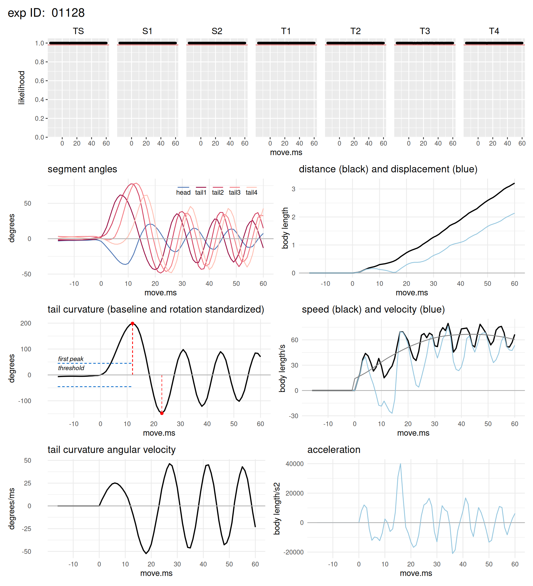
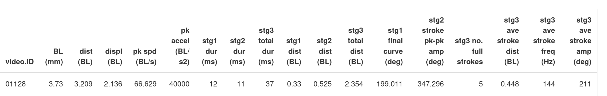

```{r, include = FALSE}
knitr::opts_chunk$set(
  collapse = TRUE,
  comment = "#>"
)
```


<!--   

# Description

Functions to calculate and visualize linear and angular swimming kinematics of zebrafish larvae (*Danio rerio*) using the pose estimates derived from a DeepLabCut neural network. Functions can be used during data collection to assess the quality of a trial as well as for post-collection analysis in single trial or multi-trial batch modes.  A function is provided to easily aggregate individual trial results into a larger, comprehensive data set. At each step, results are saved to tidy dataframes suitable for further analysis and visualization in R. 
-->

# Rationale

Genetic disorders affecting skeletal muscle function, such as muscular dystrophies and myopathies, result in weakness and impaired mobility. Zebrafish (*Danio rerio*) with similar mutations are an important pre-clinical model for developing therapies that target these diseases. It is therefore critically important to quantify the mobility of these models as a means of evaluating the efficacy of potential therapeutic treatments. 


# The problem solved by deepdanio

We used the open source toolkit DeepLabCut, abbreviated as DLC, to develop a neural network for rapidly and accurately identifying anatomical keypoints on swimming zebrafish larvae. See Mathis et al. Nat Neurosci 21, 1281–1289, 2018, and 
Nath et al. Nat Protoc 14, 2152–2176, 2019, for general information about DLC.

The pose estimates produced by DeepLabCut consist of keypoint x- and y-coordinates in .csv format, which we will refer to as a DLC .csv file. The deepdanio package converts these x- and y-coordinates into kinematic variables that mathematically describe the larva's movement. Further details are available at [Widrick et al.](https://www.biorxiv.org/content/10.1101/2024.12.05.627004v1).

<!--  deepdanio opens the pose estimation files output by DeepLabCut and uses the x- and y-coordinates of the keypoints to model the larvae as six linked body segments. Using this model, deepdanio calculates the linear kinematics of the larva's center of mass and the angular kinematics of its propulsive tail.    --> 


# Installing deepdanio

Open RStudio and install deepdanio:

    library(devtools)
    devtools::install_github("jjwidrick/deepdanio")
    

<!--  
# Dependencies

deepdanio is dependent on the following packages: 

    data.table
    kableExtra
    knitr
    patchwork
    pracma
    RcppRoll
    tidyverse
    
 -->


# Prerequisites for using deepdanio

## Video name format

Your videos must be identified by a *numerical* ID. No letters or special characters. The length of this ID number is unimportant but it must only consist of numerical characters. 

For example, our camera is setup to name .mov files consecutively: 01234.mov, 01235.mov, 01236.mov, etc. 
<!--  
DeepLabCut uses these characters when naming its pose estimation .csv files. Therefore, the DLC files derived from the three video examples above will be 01234DLC<..network_info..>.csv, 01235DLC<..network_info..>.csv, and 01236DLC<..network_info..>.csv. 

deepdanio is expecting that the ID appended by DLC consists only of numerals. 
-->


## The settings file

Before using deepdanio you will need to create a plain text file that contains key information about the data collection session. A settings file template (`settings_template.txt`) is included with the deepdanio package. You can copy this template and modify settings for your own project. The settings file has three columns: the *name* of the setting variable, its *value* (which is what you want to edit), and a brief *definition*. Do not delete, modify, or add anything in the *name* column. 

One critical bit of information contained in the setting file is the length calibration of your camera system. See the "Analyzing videos with DAQ mode" Section for practical tips on calibration.

<!--  We recommend that you calibrate at the beginning of each daily data collection session. We also recommend incorporating some time element into the settings filename so that in the future you can unequivocally match it with the DLC files produced that day. For instance, '20250305_settings.txt' contains the settings used when collecting data on March 5, 2025. 
   -->
   
## The metadata file

You will need a metadata file that includes information about your fish, such as strain, phenotype, genotype, age, treatment, etc., as well as the video ID number(s) corresponding to this fish (the same video ID discussed above). This file is used by the `dd_compile` function to link the fish's description to its kinematic data. 

A metadata template (`metadata_template.csv`) is provided for you to copy and modify. Again, modify only the values; do not add or delete columns or change column headings.

The metadata file is useful because not all of the information you want linked to a fish may be known on the day you collect measure its swimming performance. For instance, you may not know the genotype of a fish until several days or weeks after video collection. The metadata file and the `dd_compile` function make it easy to update this new information and merge it with your existing kinematic results. 


# Calculating kinematics

## Create an Rmarkdown analysis file

Open RStudio and create a new Rmarkdown html document. Here is a suggested yaml and first chunk for your file:

````markdown
---
output: html_document
---

`r ''````{r setup, include=FALSE}
library(knitr)
library(tidyverse)
library(patchwork)
library(RcppRoll) 
library(pracma)     
library(data.table)
library(kableExtra)
library(deepdanio)

knitr::opts_chunk$set(echo = FALSE, 
                      warning=FALSE, 
                      message=FALSE, 
                      fig.width=10, 
                      fig.height=11,
                      results='asis')
```
````


## Analyzing a single DLC .csv file

Swimming kinematics are calculated using the `dd_kinematics` function. 

To analyze a single DLC .csv file, open the Rmarkdown analysis file created in the previous section. Add a chunk calling `dd_kinematics` as illustrated in this example:


    dd_kinematics(analysis_mode   = ("single"), 
                  single_video_ID = ("01234"),
                  DLC_data_dir    = ("/my_DLC_data"), 
                  settings_file   = ("/my_DLC_data/settings.txt"), 
                  kin_results_dir = ("/my_kin_results"), 
                  plots           = TRUE, 
                  pk_vl_save      = TRUE)

The above will analyze the single DLC .csv file that starts with the video ID number `01234`. 

`DLC_data_dir` specifies the path to the directory holding this .csv file. In the example, the path is `"/my_DLC_data"`. In practice, we recommend that each days data shold be stored in a date-specific directory. So instead of `/my_DLC_data`, the directory could be named `/2025-03-05_DLC_data`. This is because each day of data collection will require a specific settings file as discussed in the next paragraph.  

`settings_file` is the path to the setting file that contains the information about this trial. Because the settings file contains calibration information, and you should calibrate daily, each day of data collection will have its own settings file. If you follow our advice above for naming your DLC data directory, then simply save the corresponding settings file into that directory. So in the above example, the settings file path would be `/2025-03-05_DLC_data/settings.txt`. You can take this one step further and incorporate the date into the settings filename, `/2025-03-05_DLC_data/2025-03-05_settings.txt`, to ensure that you will never get different settings files mixed up. 

`kin_results_dir` is the path to the directory where the kinematics results will be saved.

In this example, the following files will be saved to the `kin_results_dir` directory:

- A dataframe labelled `01234_all_ms.csv` consisting of kinematic variables vs. time, i.e. values calculated at every ms of the trial.
- A dataframe labelled `01234_one_row.csv` consisting of summary kinematics describing the trial.
- A dataframe labelled `01234_pk_vl_df.csv`, consisting of the transition points between escape response stages. This file does not normally need to be saved as it is mainly used for diagnostics. By setting `pk_vl_save = FALSE` this file will not be saved.

If `plot = TRUE`, dd_kinematics will produce plots of the kinematic results (in html format). Here is an example of the plot output:  

{width=90%}

- The top row shows the likelihood values across time for each keypoint. A red line indicates the xxlikelihood criteria specified in the settings file. 
- The second row, left is a plot of the angle of each tail section and the head section. Responses are smoothed based on the criteria in the settings file.
- The second row, right is a plot of distance and displacement vs. movement time. Linear kinematics are calculated from the keypoint specified in the settings file. In this example, it is calculated from keypoint S2 (see Widrick et al.](https://www.biorxiv.org/content/10.1101/2024.12.05.627004v1) for more details)).
- The third row, left plot shows tail curvature (the sum of each tail segment angle) vs movement time. It also shows the threshold (specified in the settings file) for detecting the C-start and the point identified as the curvature of the tail at the stage 1 to stage 2 transition (maximum C-start tail curvature).
- The third row, right plots speed and velocity. Smoothed speed (based on criteria in the setting file) is indiated by the light grey line. 
- The fourth row, left plot shows the tail curvature angular velocity vs movement time. 
- The fourth row, right plot shows acceleration of the specififed center of mass pf the larvae.

Selected kinematic data summarizing the trial are pronted at the bottom of the plots. These results are derived from the `by_ms.csv` and `one_row.csv` dataframes produced by `dd_kinematics`

{width=90%}


<!--  In a future version, add an argument for 'swim_behavior'. Values would be 'er' for analysis of escape response and 'ss' for analysis of spontaneous or steady swimming. The reason for this argument is that 'er' partitions movement into stages while there is no partitioning during 'ss'. The format woud be something like the following:

    dd_kinematics(analysis_mode   = ("single"), 
                  single_video_ID = ("01234"),
                  DLC_data_dir    = ("/my_DLC_data"), 
                  settings_file   = ("/settings.txt"), 
                  kin_results_dir = ("/my_kin_results"), 
                  plots           = TRUE, 
                  pk_vl_save      = NA,
                  swim_behavior   = "ss")

When swim_behavior = "ss", the pk_vl_save argument is no longer relevant because there are no stages.

-->

## Analyzing multiple DLC. csv files

To analyze all DLC .csv files in a specific directory, the function call would look like this:

    dd_kinematics(analysis_mode   = ("batch"), 
                  single_video_ID = NA,
                  DLC_data_dir    = ("/my_DLC_data"), 
                  settings_file   = ("/my_DLC_data/settings.txt"), 
                  kin_results_dir = ("/my_kin_results"), 
                  plots           = FALSE, 
                  pk_vl_save      = FALSE)

Here, the `single_video_ID` argument is not used. It can be set to `NA` or simply deleted. In this example, we did not request plots. Requesting plots during a batch analysis will require more processing time vs. not requesting plots.

This example will output two (or three if `pk-vl-df.csv = TRUE`) dataframes for each video, exactly like in single analysis mode, but will do this for each of the DLC .csv files in the `DLC_data_dir` directory. 


## Analyzing videos with DAQ mode

DAQ mode is a variant of single analysis mode that facilitates analyzing single DLC .csv files as they are generated during a data collection session. Reviewing each trial as it is collected enables you to check the quality of the data before moving on to the next trial. For instance, you may want to know if the DLC keypoint tracking was acceptable, if the larvae stayed in the camera's field of view long enough to obtain sufficient time points, etc. 

The following example shows how DAQ mode is used to accomplish this. The example assumes that your camera is configured to download videos into the Downloads directory on your computer. If videos are downloaded elsewhere, you will need to modify the paths in the examples.

1. In the Downloads directory, make two new sub-directories:
    - One for collecting the kinematic results files. In this example, we named it `2025-03-05_results` to indicate that it contains kinematic results from videos collected on March 5, 2025.
    - A second directory for storing your raw videos and DLC .csv files. In our example, we called this `2025-03-05_data`.

2. Now perform your length calibration and update your `setting.txt` file. We take a still image or a short video (and extract a single frame) of a small ruler placed in the arena, use ImageJ to calculate the pixels per known distance on the image, and enter this ratio as the length calibration constant in the setting.txt file. Move the updated settings file into the `2025-03-05_data` directory created above. 

3. Move or create an Rmarkdown analysis file in the Downloads folder as detailed above.

At this point, your Downloads directory tree should look like this:

    Downloads
        |
        |- 2025-03-05_data
        |         |
        |         |- settings.txt
        |
        |- 2025-03-05_results
        |         |
        |         |
        |
        |- analysis.Rmd

You are now all set to begin data collection and analysis.

1. Collect your first video and download it into the Downloads directory. For this example, we will assume this video is named `01234.mov`. 

2. The next step is to process your video with our neural network. Our network is available to download from the DeepLabCut [Zoo] and details on how it was created, evaluated, and used can be found [here](https://www.biorxiv.org/content/10.1101/2024.12.05.627004v1). Directions for using DeepLabCut to run the network can be found in Nath et al. Nat Protoc 14, 2152–2176, 2019. 

    This step creates a .csv pose estimation file that is saved in the Downloads directory. It also produces two other files that we will ignore (we routinely delete these two files).

At this point, your Downloads directory tree should look like this:

    Downloads
        |
        |- 2025-03-05_data
        |         |
        |         |- settings.txt
        |
        |- 2025-03-05_results
        |         |
        |         |
        |
        |- analysis.Rmd
        |- 01234.mov
        |- 01234DLC< lots of neural network info >.csv


You are now set up to use deepdanio to calculate swimming kinematics. Open your Rmarkdown analysis file with RStudio (making the Downloads directory your RStudio working directory). Add a chunk to call the DAQ analysis mode of the `dd_kinematics` function:

    dd_kinematics(analysis_mode   = ("DAQ"),   
                  single_video_ID = NA,  
                  DLC_data_dir    = NA,   
                  settings_file   = ("/2025-03-05_data/settings.txt"),   
                  kin_results_dir = ("/2025-03-05_results"),   
                  plots           = TRUE,   
                  pk_vl_save      = FALSE)

Now knit your Rmarkdown analysis file. This is how your Downloads directory tree should look like after knitting:

    Downloads
        |
        |- 2025-03-05_data
        |         |
        |         |- settings.txt
        |
        |- 2025-03-05_results
        |         |
        |         |- 01234_all_ms.csv
        |         |- 01234_one_row.csv
        |
        |- analysis.html
        |- analysis.Rmd
        |- 01234.mov
        |- 01234DLC< lots of neural network info >.csv

This is what happened when you knit your the .csv file. `dd_kinematics` evaluated whatever .csv file it found in the RStudio working drectory (which is the Downloads directory in our example). This automates the DLC .csv file selection, eliminating the need to manually enter the current `single_video_ID` number into the Rmarkdown analysis file every time `dd_kinematics` is run. 

However, this also means that you can have only ***one*** .csv file in your Downloads directory at a time. So once the current DLC .csv file has been analyzed, you need to drag it into the `/2025-03-05_raw_data` directory. You should also drag the 01234.mov file into `/2025-03-05_data` directory. This saves the video and assures when you collect your next video, only this most current video will be in the Downloads directory. 

After moving these files your Downloads directory tree should look like this:

    Downloads
        |
        |- 2025-03-05_data
        |         |
        |         |- settings.txt
        |         |- 01234.mov
        |         |- 01234DLC< lots of neural network info >.csv
        |
        |- 2025-03-05_results
        |         |
        |         |- 01234_all_ms.csv
        |         |- 01234_one_row.csv
        |
        |- analysis.html
        |- analysis.Rmd

You are now ready to collect your next video, extract keypoints with DLC, and calculate kinematics with `dd_kinematics`.

Note that the `analysis.html` file, which contains the plots of the last analyzed DLC .csv file is overwritten each time you run your analysis.Rmd file. If there is one of these html files you would like to save you need to rename the file before analyzing the next video. Alternatively, you can simply regenerate the html file later using `analysis_mode = "single"` and specifying the correct video ID number.


# Aggregrating results

`dd_kinematics` produces two (or three if you set `pk_vl_save` to TRUE) data frames per fish. At some point, you will want to do two things: 1) combine these individual data frames into a larger dataframe and 2) merge in descriptive metadata into this larger dataframe. These steps are accomplished by the `dd_compile` function. 

Create a new Rmarkdown file for compiling results:

````markdown
---
output: html_document
---

`r ''````{r setup, include=FALSE}
library(tidyverse)
library(deepdanio)

knitr::opts_chunk$set(echo = FALSE, 
                      warning=FALSE, 
                      message=FALSE, 
                      fig.width=10, 
                      fig.height=11,
                      results='asis')
```

`r ''````{r}

dd_compile(project       = "project1",
           data_dir      = "./kin_results", 
           results_dir   = "./compiled_data, 
           metadata_file = "./my_metadata.csv")
```
````

The `data_dir` directory should contain *only* the `by_ms.csv` and `one_row.csv` files you want to compile. Knitting `dd_compile` will aggregate all of these individual trial data frames, merge in the metadata, and output three tidy dataframes that are suitable for further analysis in R. These three dataframes are saved to the `results_dir` and consist of the following:

- A `by_ms` dataframe that includes results on a ms-by-ms basis for each trial.
- A `by_trials` dataframe that collapses the `by_ms` data by ms so that each row consists of the results of a single trial.
- A `fish_means` dataframe that averages trials across a fish (we typically collect three trials per fish). Each row in `fish_means` represents a single fish with its mean value for each kinematic variable.

Each of these files incorporates the date of the compile (in YYMMDD format) so that you can keep track of your most current data.

<!--  
# Appendix

## dd_kinematics arguments

analysis_mode("DAQ", "single", "batch")

- indicate one analysis mode
- "DAQ" for analysis immediately after data collection 
- "single" to analyze a single DLC .csv file
- "batch" to analyse all DLC .csv files in a directory


single_video_ID(\<path-to-file>)

- if you chose "single" for analysis_mode, then you need to provide a path to the file you wish to analyse
- DLC saves pose estimation files with a video ID at the start of the file name
- you only need to provide this ID number (deepdanio will assume that it identifies a file in the specified DLC_data_dir)


DLC_data_dir(\<path-to-directory>)

- indicate the path to the directory holding the DLC .csv file(s)   


settings_dir(\<path-to-directory>)

- indicate the path to the directory holding the appropriate settings file
- it may be convenient to organize your DLC .csv files in directories by day, with that days settings file saved in the same directory
- take care ot to get setting files mixed up because a settings file contains the calibration constant used for a specific day of data collection.


kin_results_dir(\<path-to-directory>)

- indicate the path to the directory where you want to store the kinematic results


plots(TRUE, FALSE)

- indicate whether you want to view plots of data or not


save_pk_val_df(TRUE, FALSE)

- indicate whether you want to save a df containing the time points of each tail stroke peak and valley. These breaks are incorporated into the regular kinematic analysis. Choose TRUE if you need this df for diagnostic or plotting purposes. Otherwise choose FALSE.


## dd_compile arguments

project(\<name-of-project>) 

- specify a short name for your project


data_dir(\<path-to-directory>)

- specify the path to the directory holding your `by_ms.csv` and `one_row.csv` files.

results_dir(\<path-to-directory>)

- specify the path to a directory you have created for holding the output of `dd_compile`.

metadata_file(\<path-to-file>)

- specify the path to your metadata file.

-->
   
   
   
